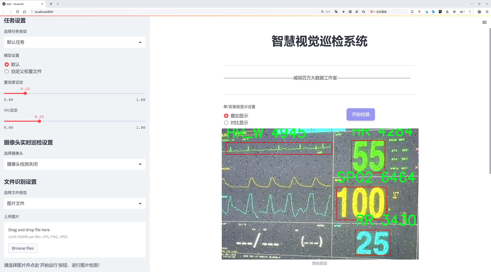
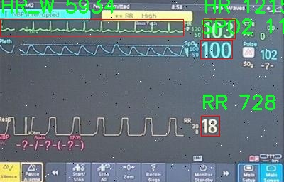

# 医疗监测数据检测检测系统源码分享
 # [一条龙教学YOLOV8标注好的数据集一键训练_70+全套改进创新点发刊_Web前端展示]

### 1.研究背景与意义

项目参考[AAAI Association for the Advancement of Artificial Intelligence](https://gitee.com/qunshansj/projects)

项目来源[AACV Association for the Advancement of Computer Vision](https://gitee.com/qunmasj/projects)

研究背景与意义

随着信息技术的迅猛发展，医疗监测数据的获取与分析逐渐成为现代医学研究的重要组成部分。尤其是在疫情期间，实时监测患者的生理参数显得尤为重要。传统的医疗监测手段往往依赖于人工记录和分析，效率低下且容易出错。因此，基于深度学习的自动化检测系统应运而生，成为提升医疗监测效率和准确性的有效工具。在众多深度学习模型中，YOLO（You Only Look Once）系列因其快速的检测速度和较高的准确率而备受关注。尤其是YOLOv8模型，凭借其在特征提取和目标检测方面的优势，成为了医疗监测数据处理的理想选择。

本研究旨在基于改进的YOLOv8模型，构建一个高效的医疗监测数据检测系统。我们使用的数据集包含2853张图像，涵盖了7个类别，包括DBP（舒张压）、HR（心率）、HR_W（心率变异性）、MAP（平均动脉压）、RR（呼吸频率）、SBP（收缩压）和SPO2（血氧饱和度）。这些生理参数是评估患者健康状况的关键指标，能够为临床决策提供重要依据。然而，如何从大量的监测数据中快速、准确地提取这些信息，仍然是一个亟待解决的问题。

在现有的医疗监测系统中，数据的自动化处理能力相对较弱，导致临床医生在数据分析时面临信息过载的挑战。通过引入改进的YOLOv8模型，我们希望能够实现对医疗监测数据的高效检测与分类，从而减轻医生的工作负担，提高诊断的及时性和准确性。该系统不仅能够实时监测患者的生理参数，还能够通过数据分析为临床决策提供支持，进而提升患者的治疗效果。

此外，基于YOLOv8的医疗监测数据检测系统的研究意义还体现在其对医疗大数据的推动作用。随着医疗数据的不断积累，如何有效利用这些数据进行智能分析已成为研究的热点。通过对监测数据的深度学习分析，我们不仅可以实现对个体患者的精准监测，还能够为公共卫生研究提供数据支持，推动医疗健康领域的智能化发展。

综上所述，基于改进YOLOv8的医疗监测数据检测系统的研究，不仅具有重要的理论价值，也具有广泛的应用前景。它将为医疗行业带来革命性的变化，推动医疗监测技术的进步，提升患者的治疗体验，最终实现更高效、更精准的医疗服务。通过本研究，我们期望能够为未来的医疗监测系统提供新的思路和方法，为推动智能医疗的发展贡献力量。

### 2.图片演示




##### 注意：由于此博客编辑较早，上面“2.图片演示”和“3.视频演示”展示的系统图片或者视频可能为老版本，新版本在老版本的基础上升级如下：（实际效果以升级的新版本为准）

  （1）适配了YOLOV8的“目标检测”模型和“实例分割”模型，通过加载相应的权重（.pt）文件即可自适应加载模型。

  （2）支持“图片识别”、“视频识别”、“摄像头实时识别”三种识别模式。

  （3）支持“图片识别”、“视频识别”、“摄像头实时识别”三种识别结果保存导出，解决手动导出（容易卡顿出现爆内存）存在的问题，识别完自动保存结果并导出到tempDir中。

  （4）支持Web前端系统中的标题、背景图等自定义修改，后面提供修改教程。

  另外本项目提供训练的数据集和训练教程,暂不提供权重文件（best.pt）,需要您按照教程进行训练后实现图片演示和Web前端界面演示的效果。

### 3.视频演示

[3.1 视频演示](https://www.bilibili.com/video/BV1St4meVEBD/)

### 4.数据集信息展示

##### 4.1 本项目数据集详细数据（类别数＆类别名）

nc: 7
names: ['DBP', 'HR', 'HR_W', 'MAP', 'RR', 'SBP', 'SPO2']


##### 4.2 本项目数据集信息介绍

数据集信息展示

在医疗监测领域，数据集的构建与应用至关重要，尤其是在利用深度学习技术进行数据检测和分析时。本研究所采用的数据集名为“dwse”，其设计旨在为改进YOLOv8的医疗监测数据检测系统提供强有力的支持。该数据集涵盖了七个关键的生理参数类别，分别为DBP（舒张压）、HR（心率）、HR_W（心率变异性）、MAP（平均动脉压）、RR（呼吸频率）、SBP（收缩压）和SPO2（血氧饱和度）。这些参数不仅是评估患者健康状况的重要指标，也是医疗监测系统中不可或缺的组成部分。

“dwse”数据集的构建过程经过了严格的标准化和验证，以确保数据的准确性和可靠性。每个类别的样本均来源于真实的临床监测数据，涵盖了不同年龄、性别和健康状况的患者。这种多样性使得数据集在训练过程中能够有效地捕捉到各种生理参数的变化特征，从而提高模型的泛化能力和预测准确性。

在数据集的具体应用中，DBP和SBP作为血压的两个重要组成部分，能够反映心血管健康状况的变化。HR和HR_W则提供了心脏功能的动态信息，帮助医生判断患者的心脏健康。MAP作为一个综合指标，能够更全面地反映血液循环的状况。RR则是评估呼吸系统功能的重要参数，尤其在重症监护中具有重要意义。最后，SPO2作为氧合状态的直接指标，对于评估患者的呼吸和循环功能至关重要。

在训练YOLOv8模型时，数据集“dwse”不仅提供了丰富的标注信息，还通过多样化的样本增强了模型的学习能力。模型在识别和检测这些生理参数时，能够利用深度学习的优势，自动提取特征并进行分类。这种自动化的过程大大提高了医疗监测的效率，减少了人工干预的需求，同时也降低了因人为因素导致的误差。

此外，数据集的设计还考虑到了临床应用的实际需求。通过对不同类别的生理参数进行细致的标注和分类，研究人员能够在模型训练后，快速识别出患者的健康状况，并及时做出相应的医疗决策。这种实时监测和反馈机制，将极大地提升医疗服务的质量和效率。

总之，“dwse”数据集的构建与应用，不仅为改进YOLOv8的医疗监测数据检测系统提供了坚实的基础，也为未来的医疗数据分析和智能监测系统的发展开辟了新的方向。通过对七个关键生理参数的深入研究和分析，研究者们能够更好地理解患者的健康状况，并为个性化医疗提供数据支持。这一切都表明，数据集在现代医疗技术中的重要性与日俱增，成为推动医疗智能化发展的重要力量。





### 5.全套项目环境部署视频教程（零基础手把手教学）

[5.1 环境部署教程链接（零基础手把手教学）](https://www.ixigua.com/7404473917358506534?logTag=c807d0cbc21c0ef59de5)


[5.2 安装Python虚拟环境创建和依赖库安装视频教程链接（零基础手把手教学）](https://www.ixigua.com/7404474678003106304?logTag=1f1041108cd1f708b01a)

### 6.手把手YOLOV8训练视频教程（零基础小白有手就能学会）

[6.1 手把手YOLOV8训练视频教程（零基础小白有手就能学会）](https://www.ixigua.com/7404477157818401292?logTag=d31a2dfd1983c9668658)

### 7.70+种全套YOLOV8创新点代码加载调参视频教程（一键加载写好的改进模型的配置文件）

[7.1 70+种全套YOLOV8创新点代码加载调参视频教程（一键加载写好的改进模型的配置文件）](https://www.ixigua.com/7404478314661806627?logTag=29066f8288e3f4eea3a4)

### 8.70+种全套YOLOV8创新点原理讲解（非科班也可以轻松写刊发刊，V10版本正在科研待更新）

由于篇幅限制，每个创新点的具体原理讲解就不一一展开，具体见下列网址中的创新点对应子项目的技术原理博客网址【Blog】：


[8.1 70+种全套YOLOV8创新点原理讲解链接](https://gitee.com/qunmasj/good)

### 9.系统功能展示（检测对象为举例，实际内容以本项目数据集为准）

图9.1.系统支持检测结果表格显示

  图9.2.系统支持置信度和IOU阈值手动调节

  图9.3.系统支持自定义加载权重文件best.pt(需要你通过步骤5中训练获得)

  图9.4.系统支持摄像头实时识别

  图9.5.系统支持图片识别

  图9.6.系统支持视频识别

  图9.7.系统支持识别结果文件自动保存

  图9.8.系统支持Excel导出检测结果数据


### 10.原始YOLOV8算法原理

原始YOLOv8算法原理

YOLOv8算法是由Ultralytics公司于2023年发布的最新目标检测模型，标志着YOLO系列算法的又一次重大进步。该算法在前几代YOLO模型的基础上，进行了多项创新和改进，旨在提升目标检测的准确性和速度，同时保持模型的轻量化和易用性。YOLOv8n作为其最小版本，采用了一系列新的网络结构和技术，形成了一个高效的目标检测框架。

在YOLOv8的设计中，主干网络采用了CSP（Cross Stage Partial）结构，这种结构将特征提取过程分为两个部分，分别进行卷积和连接，从而实现更高效的特征学习。与YOLOv5中的C3模块相比，YOLOv8引入了C2f模块，这一模块通过并行多个梯度流分支，能够在保持模型轻量化的同时，获取更丰富的梯度信息。C2f模块的设计使得模型在特征提取时，能够更好地捕捉到不同尺度和不同位置的特征，从而提高了目标检测的精度。

在特征提取之后，YOLOv8采用了快速空间金字塔池化（SPPF）模块，以进一步提升模型的计算速度和特征提取效率。SPPF模块通过对不同尺度的特征进行汇聚，能够有效减少模型的参数量和计算量，使得YOLOv8在处理复杂场景时，依然能够保持高效的性能。

YOLOv8的颈部网络采用了PAN-FPN（Path Aggregation Network - Feature Pyramid Network）结构，这一结构通过多尺度特征的融合，增强了模型对不同大小目标的检测能力。PAN-FPN能够有效地将来自不同层次的特征进行聚合，形成更为丰富的特征表示，进而提升检测的准确性和鲁棒性。

在目标检测的具体实现上，YOLOv8采用了Anchor-Free的检测方式，这一创新使得模型不再依赖于预设的锚框。传统的Anchor-Based方法虽然能够提高检测精度，但在处理不同尺寸和形状的目标时，往往需要进行复杂的IoU计算，并且预设的锚框在适应性上存在局限。YOLOv8通过将目标检测转化为关键点检测，直接预测目标的中心点和宽高比例，极大地简化了检测过程，提高了模型的泛化能力和灵活性。

在YOLOv8的检测头部分，模型采用了解耦头结构（Decoupled Head），将目标分类和边界框回归分开处理。这一设计使得模型在进行目标检测时，能够更好地聚焦于不同任务的特征学习，从而提高了检测的准确性。在损失函数的设计上，YOLOv8采用了分布焦点损失（DFL）和CIoU损失的组合，旨在使模型更快地聚焦于标签附近的数值，提高了训练的效率和效果。

此外，YOLOv8在输入图像的处理上也进行了优化。默认情况下，输入图像的尺寸为640x640，但在实际应用中，图像的长宽比往往各不相同。YOLOv8采用自适应图片缩放的策略，通过按比例缩小长边并对短边进行填充，尽量减少信息冗余，提高了目标检测和推理的速度。同时，在模型训练过程中，YOLOv8引入了Mosaic图像增强操作，通过随机拼接多张图像，迫使模型学习到不同位置和周围像素的特征，从而有效提升了模型的预测精度。

综上所述，YOLOv8算法通过一系列创新的设计和结构改进，成功地提升了目标检测的性能和灵活性。其在特征提取、特征融合、目标检测方式及损失函数等方面的优化，使得YOLOv8在各种复杂场景下都能展现出卓越的检测能力。随着YOLOv8的推出，目标检测技术又向前迈进了一大步，为后续的研究和应用提供了更为强大的工具和方法。


### 11.项目核心源码讲解（再也不用担心看不懂代码逻辑）

#### 11.1 ui.py

以下是经过精简和注释的核心代码部分：

```python
import sys
import subprocess
from QtFusion.path import abs_path

def run_script(script_path):
    """
    使用当前 Python 环境运行指定的脚本。

    Args:
        script_path (str): 要运行的脚本路径
    """
    # 获取当前 Python 解释器的路径
    python_path = sys.executable

    # 构建运行命令，使用 streamlit 运行指定的脚本
    command = f'"{python_path}" -m streamlit run "{script_path}"'

    # 执行命令并等待其完成
    result = subprocess.run(command, shell=True)
    
    # 检查命令执行结果，如果返回码不为0，则表示出错
    if result.returncode != 0:
        print("脚本运行出错。")

# 主程序入口
if __name__ == "__main__":
    # 获取脚本的绝对路径
    script_path = abs_path("web.py")

    # 调用函数运行脚本
    run_script(script_path)
```

### 代码说明：
1. **导入模块**：
   - `sys`：用于获取当前 Python 解释器的路径。
   - `subprocess`：用于执行外部命令。
   - `abs_path`：从 `QtFusion.path` 模块导入的函数，用于获取文件的绝对路径。

2. **`run_script` 函数**：
   - 接受一个参数 `script_path`，表示要运行的 Python 脚本的路径。
   - 使用 `sys.executable` 获取当前 Python 解释器的路径。
   - 构建一个命令字符串，用于运行 `streamlit`，并指定要执行的脚本。
   - 使用 `subprocess.run` 执行命令，并等待其完成。
   - 检查命令的返回码，如果不为0，表示执行过程中出现错误，打印错误信息。

3. **主程序入口**：
   - 当脚本作为主程序运行时，获取 `web.py` 的绝对路径。
   - 调用 `run_script` 函数，传入脚本路径以执行该脚本。

这个文件名为 `ui.py`，它的主要功能是通过当前的 Python 环境来运行一个指定的脚本，具体来说是运行一个名为 `web.py` 的脚本。文件中首先导入了一些必要的模块，包括 `sys`、`os` 和 `subprocess`，这些模块提供了与系统交互的功能，比如获取当前 Python 解释器的路径和执行外部命令。

在文件中定义了一个名为 `run_script` 的函数，该函数接受一个参数 `script_path`，这个参数是要运行的脚本的路径。函数内部首先获取当前 Python 解释器的路径，并将其存储在 `python_path` 变量中。接着，构建一个命令字符串 `command`，这个命令使用了 `streamlit` 模块来运行指定的脚本。`streamlit` 是一个用于构建数据应用的框架。

随后，使用 `subprocess.run` 方法来执行这个命令。`shell=True` 参数表示命令将在一个新的 shell 中执行。执行完命令后，检查返回的结果，如果返回码不为 0，说明脚本运行出错，此时会打印出错误信息。

在文件的最后部分，使用 `if __name__ == "__main__":` 语句来确保只有在直接运行这个文件时才会执行下面的代码。在这个代码块中，首先调用 `abs_path` 函数来获取 `web.py` 的绝对路径，并将其赋值给 `script_path` 变量。最后，调用 `run_script` 函数来运行这个脚本。

总的来说，这个 `ui.py` 文件的功能是通过当前的 Python 环境来启动并运行一个名为 `web.py` 的脚本，方便用户在命令行中执行数据应用。

#### 11.2 code\ultralytics\utils\downloads.py

以下是经过简化和注释的核心代码部分，主要集中在文件下载和解压缩的功能上：

```python
import contextlib
import shutil
from pathlib import Path
import requests
from zipfile import ZipFile, is_zipfile
from tqdm import tqdm  # 进度条库

def safe_download(url, file=None, dir=None, unzip=True, delete=False, retry=3, exist_ok=False):
    """
    从指定的URL下载文件，并可选择解压缩和删除下载的文件。

    Args:
        url (str): 要下载的文件的URL。
        file (str, optional): 下载后保存的文件名。如果未提供，将使用URL中的文件名。
        dir (str, optional): 保存下载文件的目录。如果未提供，将使用当前工作目录。
        unzip (bool, optional): 是否解压下载的文件。默认值为True。
        delete (bool, optional): 是否在解压后删除下载的文件。默认值为False。
        retry (int, optional): 下载失败时的重试次数。默认值为3。
        exist_ok (bool, optional): 解压时是否覆盖现有内容。默认值为False。

    Returns:
        (Path): 解压后的目录路径。
    """
    f = Path(dir or ".") / (file or Path(url).name)  # 设置文件保存路径
    if not f.is_file():  # 如果文件不存在
        for i in range(retry + 1):  # 重试下载
            try:
                response = requests.get(url, stream=True)  # 发送GET请求
                response.raise_for_status()  # 检查请求是否成功
                with open(f, "wb") as f_opened:  # 打开文件以写入
                    for chunk in response.iter_content(chunk_size=8192):  # 分块写入
                        f_opened.write(chunk)
                break  # 下载成功，退出重试循环
            except Exception as e:
                if i >= retry:  # 超过重试次数，抛出异常
                    raise ConnectionError(f"下载失败: {url}") from e

    if unzip and f.exists() and f.suffix in (".zip", ".tar", ".gz"):  # 如果需要解压
        unzip_dir = dir or f.parent  # 解压目录
        if is_zipfile(f):  # 如果是zip文件
            with ZipFile(f) as zipObj:
                zipObj.extractall(unzip_dir)  # 解压所有文件
        if delete:  # 如果需要删除
            f.unlink()  # 删除下载的文件
        return unzip_dir  # 返回解压后的目录路径

def download(url, dir=Path.cwd(), unzip=True, delete=False, threads=1, retry=3, exist_ok=False):
    """
    从指定的URL下载文件到给定目录。支持多线程下载。

    Args:
        url (str | list): 要下载的文件的URL或URL列表。
        dir (Path, optional): 文件保存的目录。默认是当前工作目录。
        unzip (bool, optional): 下载后是否解压文件。默认值为True。
        delete (bool, optional): 解压后是否删除zip文件。默认值为False。
        threads (int, optional): 用于并发下载的线程数。默认值为1。
        retry (int, optional): 下载失败时的重试次数。默认值为3。
        exist_ok (bool, optional): 解压时是否覆盖现有内容。默认值为False。
    """
    dir = Path(dir)
    dir.mkdir(parents=True, exist_ok=True)  # 创建目录
    if isinstance(url, (str, Path)):  # 如果是单个URL
        safe_download(url=url, dir=dir, unzip=unzip, delete=delete, retry=retry, exist_ok=exist_ok)
    else:  # 如果是URL列表
        for u in url:
            safe_download(url=u, dir=dir, unzip=unzip, delete=delete, retry=retry, exist_ok=exist_ok)
```

### 代码注释说明：
1. **safe_download** 函数：负责从指定的URL下载文件，并可选择解压缩和删除下载的文件。支持重试机制。
   - 使用 `requests` 库发送GET请求并下载文件。
   - 下载完成后，如果文件是压缩文件（zip/tar/gz），则解压缩到指定目录。
   - 根据参数决定是否删除下载的文件。

2. **download** 函数：负责处理单个或多个URL的下载任务，支持多线程下载。
   - 创建保存文件的目录。
   - 调用 `safe_download` 函数进行下载。

以上代码实现了文件的下载和解压缩功能，能够处理常见的文件类型和错误情况。

这个程序文件是一个用于下载和处理文件的工具，主要用于Ultralytics YOLO项目。它包含了一系列函数，能够验证URL、删除特定文件、压缩和解压文件、检查磁盘空间、从Google Drive获取文件信息、以及从GitHub下载资源等功能。

首先，文件定义了一些常量，包括在GitHub上维护的Ultralytics资产的名称和路径。这些资产包括不同版本的YOLO模型文件和其他相关文件。

`is_url`函数用于验证给定字符串是否为有效的URL，并可选择性地检查该URL是否在线。它使用`urllib`库解析URL，并在需要时通过`urlopen`检查其可用性。

`delete_dsstore`函数用于删除指定目录下的`.DS_Store`文件，这些文件是由macOS系统生成的隐藏文件，通常在跨平台文件传输时可能引起问题。

`zip_directory`和`unzip_file`函数分别用于压缩和解压缩目录。压缩时可以选择排除特定文件，解压缩时则会创建一个与压缩文件同名的目录以存放解压后的内容。

`check_disk_space`函数用于检查下载文件所需的磁盘空间是否充足。它会获取文件的大小并与当前可用的磁盘空间进行比较，确保在下载前有足够的空间。

`get_google_drive_file_info`函数从Google Drive的共享链接中提取直接下载链接和文件名，处理可能的下载配额超限问题。

`safe_download`函数是下载文件的核心功能，支持从URL下载文件，并可以选择解压缩、删除原文件、重试下载等。它还支持使用`curl`命令行工具进行下载，并在下载失败时进行重试。

`get_github_assets`函数用于从指定的GitHub仓库获取发布版本的标签和资产列表，允许用户获取最新的资源。

`attempt_download_asset`函数尝试从GitHub下载指定的文件，如果本地不存在则从GitHub的发布资产中下载。

最后，`download`函数支持从指定的URL下载文件，可以处理单个或多个URL，并支持并发下载。它会确保下载的文件被保存到指定的目录，并可以选择解压缩和删除压缩文件。

整体来看，这个文件提供了一整套文件下载和处理的工具，适用于需要从网络获取模型文件或数据集的场景，尤其是在机器学习和计算机视觉领域。

#### 11.3 code\ultralytics\data\base.py

以下是代码中最核心的部分，并附上详细的中文注释：

```python
class BaseDataset(Dataset):
    """
    基础数据集类，用于加载和处理图像数据。

    参数:
        img_path (str): 包含图像的文件夹路径。
        imgsz (int, optional): 图像大小，默认为640。
        cache (bool, optional): 在训练期间将图像缓存到RAM或磁盘，默认为False。
        augment (bool, optional): 如果为True，则应用数据增强，默认为True。
        hyp (dict, optional): 应用数据增强的超参数，默认为None。
        prefix (str, optional): 日志消息中打印的前缀，默认为''。
        rect (bool, optional): 如果为True，则使用矩形训练，默认为False。
        batch_size (int, optional): 批次大小，默认为None。
        stride (int, optional): 步幅，默认为32。
        pad (float, optional): 填充，默认为0.0。
        single_cls (bool, optional): 如果为True，则使用单类训练，默认为False。
        classes (list): 包含的类的列表，默认为None。
        fraction (float): 使用的数据集的比例，默认为1.0（使用所有数据）。

    属性:
        im_files (list): 图像文件路径列表。
        labels (list): 标签数据字典列表。
        ni (int): 数据集中图像的数量。
        ims (list): 加载的图像列表。
        npy_files (list): numpy文件路径列表。
        transforms (callable): 图像转换函数。
    """

    def __init__(self, img_path, imgsz=640, cache=False, augment=True, hyp=DEFAULT_CFG, prefix="", rect=False, batch_size=16, stride=32, pad=0.5, single_cls=False, classes=None, fraction=1.0):
        """使用给定的配置和选项初始化BaseDataset。"""
        super().__init__()
        self.img_path = img_path  # 图像路径
        self.imgsz = imgsz  # 图像大小
        self.augment = augment  # 是否应用数据增强
        self.single_cls = single_cls  # 是否使用单类训练
        self.prefix = prefix  # 日志前缀
        self.fraction = fraction  # 使用的数据集比例
        self.im_files = self.get_img_files(self.img_path)  # 获取图像文件列表
        self.labels = self.get_labels()  # 获取标签信息
        self.update_labels(include_class=classes)  # 更新标签以仅包含指定类
        self.ni = len(self.labels)  # 数据集中图像的数量
        self.rect = rect  # 是否使用矩形训练
        self.batch_size = batch_size  # 批次大小
        self.stride = stride  # 步幅
        self.pad = pad  # 填充
        if self.rect:
            assert self.batch_size is not None  # 确保批次大小已定义
            self.set_rectangle()  # 设置矩形训练

        # 预留缓冲区用于拼接图像
        self.buffer = []  # 缓冲区大小 = 批次大小
        self.max_buffer_length = min((self.ni, self.batch_size * 8, 1000)) if self.augment else 0  # 最大缓冲区长度

        # 缓存图像
        if cache == "ram" and not self.check_cache_ram():
            cache = False  # 如果RAM缓存不可用，则不缓存
        self.ims, self.im_hw0, self.im_hw = [None] * self.ni, [None] * self.ni, [None] * self.ni  # 初始化图像和尺寸
        self.npy_files = [Path(f).with_suffix(".npy") for f in self.im_files]  # 生成numpy文件路径
        if cache:
            self.cache_images(cache)  # 缓存图像

        # 图像转换
        self.transforms = self.build_transforms(hyp=hyp)  # 构建图像转换

    def get_img_files(self, img_path):
        """读取图像文件。"""
        try:
            f = []  # 图像文件列表
            for p in img_path if isinstance(img_path, list) else [img_path]:
                p = Path(p)  # 适应不同操作系统
                if p.is_dir():  # 如果是目录
                    f += glob.glob(str(p / "**" / "*.*"), recursive=True)  # 递归获取所有图像文件
                elif p.is_file():  # 如果是文件
                    with open(p) as t:
                        t = t.read().strip().splitlines()  # 读取文件内容
                        parent = str(p.parent) + os.sep
                        f += [x.replace("./", parent) if x.startswith("./") else x for x in t]  # 将相对路径转换为绝对路径
                else:
                    raise FileNotFoundError(f"{self.prefix}{p} does not exist")  # 文件不存在异常
            im_files = sorted(x.replace("/", os.sep) for x in f if x.split(".")[-1].lower() in IMG_FORMATS)  # 过滤出有效的图像文件
            assert im_files, f"{self.prefix}No images found in {img_path}"  # 确保找到图像文件
        except Exception as e:
            raise FileNotFoundError(f"{self.prefix}Error loading data from {img_path}\n{HELP_URL}") from e  # 加载数据异常
        if self.fraction < 1:
            im_files = im_files[: round(len(im_files) * self.fraction)]  # 根据比例筛选图像文件
        return im_files

    def load_image(self, i, rect_mode=True):
        """从数据集中加载一张图像，返回（图像，原始尺寸）。"""
        im, f, fn = self.ims[i], self.im_files[i], self.npy_files[i]  # 获取图像、文件路径和numpy文件路径
        if im is None:  # 如果图像未缓存
            if fn.exists():  # 如果numpy文件存在
                try:
                    im = np.load(fn)  # 加载numpy文件
                except Exception as e:
                    LOGGER.warning(f"{self.prefix}WARNING ⚠️ Removing corrupt *.npy image file {fn} due to: {e}")  # 警告并删除损坏的文件
                    Path(fn).unlink(missing_ok=True)  # 删除损坏的numpy文件
                    im = cv2.imread(f)  # 读取图像
            else:  # 读取图像
                im = cv2.imread(f)  # 读取图像
            if im is None:
                raise FileNotFoundError(f"Image Not Found {f}")  # 图像未找到异常

            h0, w0 = im.shape[:2]  # 获取原始高度和宽度
            if rect_mode:  # 如果使用矩形模式
                r = self.imgsz / max(h0, w0)  # 计算缩放比例
                if r != 1:  # 如果大小不相等
                    w, h = (min(math.ceil(w0 * r), self.imgsz), min(math.ceil(h0 * r), self.imgsz))  # 计算新的宽度和高度
                    im = cv2.resize(im, (w, h), interpolation=cv2.INTER_LINEAR)  # 按比例调整图像大小
            elif not (h0 == w0 == self.imgsz):  # 如果不是正方形图像
                im = cv2.resize(im, (self.imgsz, self.imgsz), interpolation=cv2.INTER_LINEAR)  # 将图像拉伸为正方形

            # 如果进行数据增强，则将图像添加到缓冲区
            if self.augment:
                self.ims[i], self.im_hw0[i], self.im_hw[i] = im, (h0, w0), im.shape[:2]  # 保存图像和尺寸
                self.buffer.append(i)  # 将索引添加到缓冲区
                if len(self.buffer) >= self.max_buffer_length:  # 如果缓冲区已满
                    j = self.buffer.pop(0)  # 移除最旧的索引
                    self.ims[j], self.im_hw0[j], self.im_hw[j] = None, None, None  # 清空对应的图像数据

            return im, (h0, w0), im.shape[:2]  # 返回图像和尺寸

        return self.ims[i], self.im_hw0[i], self.im_hw[i]  # 返回缓存的图像和尺寸

    def __getitem__(self, index):
        """返回给定索引的转换标签信息。"""
        return self.transforms(self.get_image_and_label(index))  # 应用转换并返回图像和标签

    def __len__(self):
        """返回数据集中标签列表的长度。"""
        return len(self.labels)  # 返回标签数量

    def build_transforms(self, hyp=None):
        """
        用户可以在此自定义增强。

        示例:
            ```python
            if self.augment:
                # 训练转换
                return Compose([])
            else:
                # 验证转换
                return Compose([])
            ```
        """
        raise NotImplementedError  # 需要用户实现

    def get_labels(self):
        """
        用户可以在此自定义标签格式。

        注意:
            确保输出是一个包含以下键的字典:
            ```python
            dict(
                im_file=im_file,
                shape=shape,  # 格式: (高度, 宽度)
                cls=cls,
                bboxes=bboxes, # xywh
                segments=segments,  # xy
                keypoints=keypoints, # xy
                normalized=True, # 或 False
                bbox_format="xyxy",  # 或 xywh, ltwh
            )
            ```
        """
        raise NotImplementedError  # 需要用户实现
```

### 代码核心部分解释：
1. **BaseDataset类**：这是一个基础数据集类，继承自PyTorch的`Dataset`类，主要用于加载和处理图像数据。
2. **初始化方法**：在初始化时，设置图像路径、图像大小、是否进行数据增强等参数，并加载图像文件和标签。
3. **get_img_files方法**：读取指定路径下的图像文件，支持目录和文件列表的输入，返回有效的图像文件路径。
4. **load_image方法**：根据索引加载图像，支持从numpy文件加载和图像读取，并根据需要调整图像大小。
5. **getitem和len方法**：实现了数据集的索引访问和长度计算，允许在训练过程中按批次获取数据。
6. **build_transforms和get_labels方法**：这两个方法是抽象方法，用户需要根据自己的需求实现数据增强和标签格式化的逻辑。

这个程序文件定义了一个名为 `BaseDataset` 的类，主要用于加载和处理图像数据，特别是在深度学习任务中，如目标检测。这个类继承自 PyTorch 的 `Dataset` 类，提供了一系列方法和属性来支持图像数据的管理和预处理。

在初始化方法 `__init__` 中，类接受多个参数，包括图像路径、图像大小、是否缓存图像、数据增强的设置、超参数、批处理大小等。根据这些参数，类会读取图像文件，更新标签信息，并根据需要缓存图像到内存或磁盘。

`get_img_files` 方法用于读取指定路径下的图像文件，支持从目录和文件中读取。它会检查文件格式是否符合要求，并根据 `fraction` 参数决定使用数据集的哪一部分。`update_labels` 方法则用于更新标签信息，以便只包含指定的类别。

`load_image` 方法负责加载单张图像，并根据需要进行缩放和缓存。如果图像未被缓存，它会尝试从磁盘读取图像或从缓存的 NumPy 文件中加载。此方法还会根据长边调整图像大小，以保持其纵横比。

`cache_images` 方法用于将图像缓存到内存或磁盘，以加快后续加载速度。它会使用多线程来提高效率。`check_cache_ram` 方法则检查系统可用内存，以确定是否可以将图像缓存到 RAM 中。

`set_rectangle` 方法用于设置 YOLO 检测的边界框形状为矩形，适用于不规则形状的图像批处理。`__getitem__` 方法根据索引返回图像及其标签信息，并应用必要的变换。

`build_transforms` 和 `get_labels` 方法是留给用户自定义的，用户可以根据需要实现数据增强和标签格式化的逻辑。

总的来说，这个类为处理图像数据提供了灵活的框架，支持多种配置选项，适用于深度学习模型的训练和评估。

#### 11.4 70+种YOLOv8算法改进源码大全和调试加载训练教程（非必要）\ultralytics\models\fastsam\prompt.py

以下是经过简化和注释的核心代码部分：

```python
import os
import numpy as np
import torch
from PIL import Image
import cv2
from ultralytics.utils import TQDM

class FastSAMPrompt:
    """
    Fast Segment Anything Model类，用于图像标注和可视化。
    """

    def __init__(self, source, results, device='cuda') -> None:
        """初始化FastSAMPrompt，设置源图像、结果和计算设备。"""
        self.device = device  # 计算设备
        self.results = results  # 检测或分割结果
        self.source = source  # 源图像或图像路径

        # 导入CLIP模型
        try:
            import clip  # 用于线性分配
        except ImportError:
            from ultralytics.utils.checks import check_requirements
            check_requirements('git+https://github.com/openai/CLIP.git')
            import clip
        self.clip = clip  # 赋值CLIP模型

    @staticmethod
    def _segment_image(image, bbox):
        """根据提供的边界框坐标对图像进行分割。"""
        image_array = np.array(image)  # 将图像转换为数组
        segmented_image_array = np.zeros_like(image_array)  # 创建与原图像相同大小的全零数组
        x1, y1, x2, y2 = bbox  # 解包边界框坐标
        segmented_image_array[y1:y2, x1:x2] = image_array[y1:y2, x1:x2]  # 进行分割
        segmented_image = Image.fromarray(segmented_image_array)  # 转换为图像
        black_image = Image.new('RGB', image.size, (255, 255, 255))  # 创建白色背景图像
        transparency_mask = np.zeros((image_array.shape[0], image_array.shape[1]), dtype=np.uint8)  # 创建透明度掩码
        transparency_mask[y1:y2, x1:x2] = 255  # 设置分割区域的透明度
        transparency_mask_image = Image.fromarray(transparency_mask, mode='L')  # 转换为图像
        black_image.paste(segmented_image, mask=transparency_mask_image)  # 将分割图像粘贴到白色背景上
        return black_image  # 返回最终的分割图像

    @staticmethod
    def _format_results(result, filter=0):
        """将检测结果格式化为包含ID、分割、边界框、得分和面积的注释列表。"""
        annotations = []
        n = len(result.masks.data) if result.masks is not None else 0  # 获取掩码数量
        for i in range(n):
            mask = result.masks.data[i] == 1.0  # 获取当前掩码
            if torch.sum(mask) >= filter:  # 过滤小于阈值的掩码
                annotation = {
                    'id': i,
                    'segmentation': mask.cpu().numpy(),
                    'bbox': result.boxes.data[i],
                    'score': result.boxes.conf[i]}
                annotation['area'] = annotation['segmentation'].sum()  # 计算面积
                annotations.append(annotation)  # 添加到注释列表
        return annotations  # 返回格式化的注释列表

    def plot(self, annotations, output):
        """
        在图像上绘制注释、边界框和点，并保存输出。
        """
        pbar = TQDM(annotations, total=len(annotations))  # 创建进度条
        for ann in pbar:
            result_name = os.path.basename(ann.path)  # 获取结果名称
            image = ann.orig_img[..., ::-1]  # BGR转RGB
            plt.figure(figsize=(image.shape[1] / 100, image.shape[0] / 100))  # 设置图像大小
            plt.imshow(image)  # 显示图像

            if ann.masks is not None:
                masks = ann.masks.data  # 获取掩码数据
                self.fast_show_mask(masks, plt.gca())  # 显示掩码

            # 保存图像
            save_path = os.path.join(output, result_name)
            plt.axis('off')  # 关闭坐标轴
            plt.savefig(save_path, bbox_inches='tight', pad_inches=0, transparent=True)  # 保存图像
            plt.close()  # 关闭图像
            pbar.set_description(f'Saving {result_name} to {save_path}')  # 更新进度条描述

    @staticmethod
    def fast_show_mask(annotation, ax):
        """
        快速在给定的matplotlib轴上显示掩码注释。
        """
        n, h, w = annotation.shape  # 获取掩码的数量、高度和宽度
        areas = np.sum(annotation, axis=(1, 2))  # 计算每个掩码的面积
        annotation = annotation[np.argsort(areas)]  # 按面积排序掩码

        # 创建透明度和颜色
        color = np.random.random((n, 1, 1, 3))  # 随机颜色
        transparency = np.ones((n, 1, 1, 1)) * 0.6  # 透明度
        visual = np.concatenate([color, transparency], axis=-1)  # 合并颜色和透明度

        # 显示掩码
        show = np.zeros((h, w, 4))  # 创建显示图像
        h_indices, w_indices = np.meshgrid(np.arange(h), np.arange(w), indexing='ij')  # 创建网格
        indices = (annotation != 0).argmax(axis=0)  # 获取每个像素的掩码索引
        show[h_indices, w_indices, :] = visual[indices]  # 设置显示图像的颜色

        ax.imshow(show)  # 显示掩码

    @torch.no_grad()
    def retrieve(self, model, preprocess, elements, search_text: str) -> int:
        """处理图像和文本，计算相似度并返回softmax得分。"""
        preprocessed_images = [preprocess(image).to(self.device) for image in elements]  # 预处理图像
        tokenized_text = self.clip.tokenize([search_text]).to(self.device)  # 处理文本
        stacked_images = torch.stack(preprocessed_images)  # 堆叠图像
        image_features = model.encode_image(stacked_images)  # 编码图像特征
        text_features = model.encode_text(tokenized_text)  # 编码文本特征
        image_features /= image_features.norm(dim=-1, keepdim=True)  # 归一化图像特征
        text_features /= text_features.norm(dim=-1, keepdim=True)  # 归一化文本特征
        probs = 100.0 * image_features @ text_features.T  # 计算相似度
        return probs[:, 0].softmax(dim=0)  # 返回softmax得分
```

### 代码说明：
1. **类的定义**：`FastSAMPrompt`类用于处理图像分割和标注。
2. **初始化方法**：在初始化时设置计算设备、源图像和结果，并导入CLIP模型。
3. **图像分割**：`_segment_image`方法根据给定的边界框对图像进行分割。
4. **结果格式化**：`_format_results`方法将检测结果格式化为包含ID、分割、边界框等信息的注释列表。
5. **绘图方法**：`plot`方法在图像上绘制注释和掩码，并保存输出图像。
6. **快速显示掩码**：`fast_show_mask`方法在指定的matplotlib轴上快速显示掩码。
7. **相似度检索**：`retrieve`方法处理图像和文本，计算相似度并返回softmax得分。

这个程序文件定义了一个名为 `FastSAMPrompt` 的类，主要用于图像注释和可视化，结合了目标检测和分割的功能。类的构造函数接受源图像、检测结果和计算设备（如 CPU 或 GPU）作为参数，并尝试导入 CLIP 模型以进行线性分配。

在类中，有多个静态方法和实例方法。静态方法包括 `_segment_image`、`_format_results`、`_get_bbox_from_mask` 等，用于处理图像分割、格式化检测结果和从掩码中获取边界框。这些方法利用 NumPy 和 OpenCV 进行图像处理，能够从输入的图像和检测结果中提取有用的信息。

`plot` 方法用于在图像上绘制注释、边界框和点，并将结果保存到指定的输出目录。它使用 Matplotlib 进行可视化，支持多种参数配置，如是否使用随机颜色、是否绘制轮廓等。

`fast_show_mask` 方法则是一个快速显示掩码注释的辅助函数，能够在给定的 Matplotlib 轴上展示掩码。它支持随机颜色和透明度设置，并可以绘制边界框和点。

类中还包含一些与模型推理相关的方法，如 `retrieve`，用于处理图像和文本，计算相似度并返回软最大值分数。此外，`_crop_image` 方法根据提供的注释格式裁剪图像，并返回裁剪后的图像和相关数据。

`box_prompt`、`point_prompt` 和 `text_prompt` 方法分别用于根据边界框、点和文本提示调整掩码。这些方法会根据用户输入的边界框或点来修改检测结果，计算交并比（IoU）以确定最佳掩码。

最后，`everything_prompt` 方法返回处理后的结果，整合了之前的方法输出。整体而言，这个类提供了一套完整的工具，用于图像分割和注释的处理，结合了深度学习模型的推理能力。

#### 11.5 train.py

以下是代码中最核心的部分，并附上详细的中文注释：

```python
class DetectionTrainer(BaseTrainer):
    """
    DetectionTrainer类用于基于检测模型进行训练，继承自BaseTrainer类。
    """

    def build_dataset(self, img_path, mode="train", batch=None):
        """
        构建YOLO数据集。

        参数:
            img_path (str): 包含图像的文件夹路径。
            mode (str): 模式，'train'表示训练模式，'val'表示验证模式。
            batch (int, optional): 批次大小，仅用于'rect'模式。默认为None。
        """
        gs = max(int(de_parallel(self.model).stride.max() if self.model else 0), 32)
        return build_yolo_dataset(self.args, img_path, batch, self.data, mode=mode, rect=mode == "val", stride=gs)

    def get_dataloader(self, dataset_path, batch_size=16, rank=0, mode="train"):
        """构建并返回数据加载器。"""
        assert mode in ["train", "val"]  # 确保模式为'train'或'val'
        with torch_distributed_zero_first(rank):  # 在分布式环境中仅初始化一次数据集
            dataset = self.build_dataset(dataset_path, mode, batch_size)
        shuffle = mode == "train"  # 训练模式下打乱数据
        if getattr(dataset, "rect", False) and shuffle:
            LOGGER.warning("WARNING ⚠️ 'rect=True'与DataLoader的shuffle不兼容，设置shuffle=False")
            shuffle = False
        workers = self.args.workers if mode == "train" else self.args.workers * 2  # 设置工作线程数
        return build_dataloader(dataset, batch_size, workers, shuffle, rank)  # 返回数据加载器

    def preprocess_batch(self, batch):
        """对一批图像进行预处理，包括缩放和转换为浮点数。"""
        batch["img"] = batch["img"].to(self.device, non_blocking=True).float() / 255  # 将图像转换为浮点数并归一化
        if self.args.multi_scale:  # 如果启用多尺度
            imgs = batch["img"]
            sz = (
                random.randrange(self.args.imgsz * 0.5, self.args.imgsz * 1.5 + self.stride)
                // self.stride
                * self.stride
            )  # 随机选择新的尺寸
            sf = sz / max(imgs.shape[2:])  # 计算缩放因子
            if sf != 1:
                ns = [
                    math.ceil(x * sf / self.stride) * self.stride for x in imgs.shape[2:]
                ]  # 计算新的形状
                imgs = nn.functional.interpolate(imgs, size=ns, mode="bilinear", align_corners=False)  # 进行插值
            batch["img"] = imgs  # 更新批次中的图像
        return batch

    def set_model_attributes(self):
        """设置模型的属性，包括类别数量和名称。"""
        self.model.nc = self.data["nc"]  # 将类别数量附加到模型
        self.model.names = self.data["names"]  # 将类别名称附加到模型
        self.model.args = self.args  # 将超参数附加到模型

    def get_model(self, cfg=None, weights=None, verbose=True):
        """返回YOLO检测模型。"""
        model = DetectionModel(cfg, nc=self.data["nc"], verbose=verbose and RANK == -1)  # 创建检测模型
        if weights:
            model.load(weights)  # 加载权重
        return model

    def get_validator(self):
        """返回用于YOLO模型验证的DetectionValidator。"""
        self.loss_names = "box_loss", "cls_loss", "dfl_loss"  # 定义损失名称
        return yolo.detect.DetectionValidator(
            self.test_loader, save_dir=self.save_dir, args=copy(self.args), _callbacks=self.callbacks
        )

    def label_loss_items(self, loss_items=None, prefix="train"):
        """
        返回带有标签的训练损失项字典。

        对于分类不需要，但对于分割和检测是必要的。
        """
        keys = [f"{prefix}/{x}" for x in self.loss_names]  # 创建损失项的键
        if loss_items is not None:
            loss_items = [round(float(x), 5) for x in loss_items]  # 将张量转换为保留5位小数的浮点数
            return dict(zip(keys, loss_items))  # 返回键值对字典
        else:
            return keys  # 返回键列表

    def progress_string(self):
        """返回格式化的训练进度字符串，包括epoch、GPU内存、损失、实例和大小。"""
        return ("\n" + "%11s" * (4 + len(self.loss_names))) % (
            "Epoch",
            "GPU_mem",
            *self.loss_names,
            "Instances",
            "Size",
        )

    def plot_training_samples(self, batch, ni):
        """绘制带有注释的训练样本。"""
        plot_images(
            images=batch["img"],
            batch_idx=batch["batch_idx"],
            cls=batch["cls"].squeeze(-1),
            bboxes=batch["bboxes"],
            paths=batch["im_file"],
            fname=self.save_dir / f"train_batch{ni}.jpg",
            on_plot=self.on_plot,
        )

    def plot_metrics(self):
        """从CSV文件中绘制指标。"""
        plot_results(file=self.csv, on_plot=self.on_plot)  # 保存结果图像

    def plot_training_labels(self):
        """创建YOLO模型的标记训练图。"""
        boxes = np.concatenate([lb["bboxes"] for lb in self.train_loader.dataset.labels], 0)  # 合并所有边界框
        cls = np.concatenate([lb["cls"] for lb in self.train_loader.dataset.labels], 0)  # 合并所有类别
        plot_labels(boxes, cls.squeeze(), names=self.data["names"], save_dir=self.save_dir, on_plot=self.on_plot)  # 绘制标签
```

### 代码核心部分说明：
1. **DetectionTrainer类**：这是一个用于训练YOLO检测模型的类，继承自`BaseTrainer`。
2. **数据集构建**：`build_dataset`方法用于构建YOLO数据集，支持训练和验证模式。
3. **数据加载器**：`get_dataloader`方法构建数据加载器，支持多线程和数据打乱。
4. **批处理预处理**：`preprocess_batch`方法对输入图像进行预处理，包括归一化和多尺度调整。
5. **模型属性设置**：`set_model_attributes`方法设置模型的类别数量和名称。
6. **模型获取**：`get_model`方法返回YOLO检测模型，并可加载预训练权重。
7. **损失项标签**：`label_loss_items`方法返回训练损失的标签和数值。
8. **进度字符串**：`progress_string`方法返回训练进度的格式化字符串。
9. **绘图功能**：提供多个绘图方法，用于可视化训练样本、指标和标签。

这个程序文件 `train.py` 是一个用于训练 YOLO（You Only Look Once）目标检测模型的脚本，继承自 `BaseTrainer` 类。它包含了一系列方法，用于构建数据集、获取数据加载器、预处理图像、设置模型属性、获取模型、验证模型、记录损失、显示训练进度、绘制训练样本和绘制训练指标等。

在文件的开头，导入了一些必要的库和模块，包括数学运算、随机数生成、深度学习框架 PyTorch 相关的模块，以及 Ultralytics 提供的工具和函数。

`DetectionTrainer` 类是训练的核心，提供了多种方法来处理训练过程。`build_dataset` 方法用于构建 YOLO 数据集，接收图像路径、模式（训练或验证）和批次大小作为参数。它会根据模型的步幅计算合适的步幅大小，并调用 `build_yolo_dataset` 函数来创建数据集。

`get_dataloader` 方法则负责构建数据加载器，确保在分布式训练时只初始化一次数据集。它根据模式决定是否打乱数据，并设置工作线程的数量。

`preprocess_batch` 方法用于对一批图像进行预处理，包括将图像缩放到适当的大小并转换为浮点数格式。若启用多尺度训练，它会随机选择一个新的图像大小并对图像进行插值处理。

`set_model_attributes` 方法用于设置模型的属性，包括类别数量和类别名称等，以确保模型能够正确处理数据集中的目标。

`get_model` 方法用于返回一个 YOLO 检测模型，支持加载预训练权重。

`get_validator` 方法返回一个用于验证模型的 `DetectionValidator` 实例，帮助在训练过程中评估模型的性能。

`label_loss_items` 方法用于返回带有标签的训练损失项字典，方便记录和监控训练过程中的损失。

`progress_string` 方法生成一个格式化的字符串，显示训练进度，包括当前的 epoch、GPU 内存使用情况、损失值、实例数量和图像大小等信息。

`plot_training_samples` 方法用于绘制训练样本及其标注，便于可视化训练数据的质量。

最后，`plot_metrics` 和 `plot_training_labels` 方法分别用于绘制训练过程中的指标和创建带标签的训练图，帮助分析模型的训练效果。

整体而言，这个脚本提供了一个结构化的方式来训练 YOLO 模型，涵盖了从数据准备到模型训练和评估的各个方面。

#### 11.6 70+种YOLOv8算法改进源码大全和调试加载训练教程（非必要）\ultralytics\utils\callbacks\dvc.py

以下是经过简化并注释的核心代码部分：

```python
# 导入必要的库
from ultralytics.utils import LOGGER, SETTINGS, TESTS_RUNNING, checks

try:
    # 确保没有在运行测试
    assert not TESTS_RUNNING  
    # 确保DVC集成已启用
    assert SETTINGS['dvc'] is True  
    import dvclive  # 导入DVCLive库
    # 检查DVCLive版本
    assert checks.check_version('dvclive', '2.11.0', verbose=True)

    import os
    import re
    from pathlib import Path

    # DVCLive日志记录实例
    live = None
    _processed_plots = {}  # 记录已处理的图表

    # 训练周期标志
    _training_epoch = False

except (ImportError, AssertionError, TypeError):
    dvclive = None  # 如果导入失败，dvclive设置为None


def _log_images(path, prefix=''):
    """记录指定路径的图像，带有可选前缀。"""
    if live:  # 如果DVCLive实例存在
        name = path.name
        # 通过批次分组图像，以便在UI中启用滑块
        m = re.search(r'_batch(\d+)', name)
        if m:
            ni = m[1]
            new_stem = re.sub(r'_batch(\d+)', '_batch', path.stem)
            name = (Path(new_stem) / ni).with_suffix(path.suffix)

        live.log_image(os.path.join(prefix, name), path)  # 记录图像


def on_train_start(trainer):
    """在训练开始时记录训练参数。"""
    if live:  # 如果DVCLive实例存在
        live.log_params(trainer.args)  # 记录训练参数


def on_fit_epoch_end(trainer):
    """在每个训练周期结束时记录训练指标和模型信息。"""
    global _training_epoch
    if live and _training_epoch:  # 如果DVCLive实例存在且正在训练周期
        all_metrics = {**trainer.label_loss_items(trainer.tloss, prefix='train'), **trainer.metrics, **trainer.lr}
        for metric, value in all_metrics.items():
            live.log_metric(metric, value)  # 记录指标

        # 记录模型信息
        if trainer.epoch == 0:
            from ultralytics.utils.torch_utils import model_info_for_loggers
            for metric, value in model_info_for_loggers(trainer).items():
                live.log_metric(metric, value, plot=False)

        live.next_step()  # 进入下一个步骤
        _training_epoch = False  # 重置训练周期标志


def on_train_end(trainer):
    """在训练结束时记录最佳指标和混淆矩阵。"""
    if live:  # 如果DVCLive实例存在
        # 记录最佳指标
        all_metrics = {**trainer.label_loss_items(trainer.tloss, prefix='train'), **trainer.metrics, **trainer.lr}
        for metric, value in all_metrics.items():
            live.log_metric(metric, value, plot=False)

        # 记录混淆矩阵
        _log_confusion_matrix(trainer.validator)

        live.end()  # 结束日志记录


# 回调函数字典
callbacks = {
    'on_train_start': on_train_start,
    'on_fit_epoch_end': on_fit_epoch_end,
    'on_train_end': on_train_end
} if dvclive else {}
```

### 代码说明：
1. **导入库**：导入了Ultralytics YOLO所需的库和模块，包括DVCLive用于日志记录。
2. **异常处理**：在尝试导入DVCLive和检查设置时，捕获可能的异常，确保程序的稳定性。
3. **日志记录函数**：
   - `_log_images`：记录图像，支持批次分组。
   - `on_train_start`：在训练开始时记录参数。
   - `on_fit_epoch_end`：在每个训练周期结束时记录指标和模型信息。
   - `on_train_end`：在训练结束时记录最佳指标和混淆矩阵。
4. **回调函数**：根据DVCLive的可用性定义回调函数字典，用于在训练过程中调用相应的日志记录函数。

这个程序文件是一个用于YOLOv8算法训练过程中的回调函数实现，主要负责与DVCLive库的集成，以便在训练过程中记录和可视化各种训练指标和结果。文件首先导入了必要的模块和库，并进行了基本的环境检查，确保在非测试模式下运行，并且DVCLive集成已启用。

文件中定义了一些全局变量，包括一个DVCLive日志实例和一个用于跟踪已处理图像的字典。接下来，程序定义了一些辅助函数，用于记录图像、绘图和混淆矩阵等信息。例如，`_log_images`函数用于记录指定路径下的图像，并根据需要添加前缀；`_log_plots`函数用于记录训练过程中生成的绘图，确保每个绘图只被处理一次；而`_log_confusion_matrix`函数则用于记录混淆矩阵，帮助分析模型的分类性能。

在训练的不同阶段，程序会调用相应的回调函数。`on_pretrain_routine_start`函数在预训练开始时初始化DVCLive日志器，并记录相关信息；`on_pretrain_routine_end`函数在预训练结束时记录训练过程中的绘图；`on_train_start`函数在训练开始时记录训练参数；`on_train_epoch_start`函数在每个训练周期开始时设置一个标志；`on_fit_epoch_end`函数在每个训练周期结束时记录训练指标和模型信息，并准备进入下一个步骤；`on_train_end`函数在训练结束时记录最佳指标、绘图和混淆矩阵。

最后，程序将这些回调函数组织成一个字典，便于在训练过程中调用，确保只有在DVCLive可用时才会注册这些回调。整体上，这个文件的目的是增强YOLOv8训练过程中的可视化和监控能力，使得用户能够更好地理解和分析模型的训练情况。

### 12.系统整体结构（节选）

### 整体功能和构架概括

该程序库主要围绕YOLOv8目标检测模型的训练、推理和可视化展开，提供了一系列工具和模块来支持数据处理、模型训练、结果评估和可视化。整体架构包括数据加载与处理、模型定义与训练、结果记录与可视化等多个方面。具体来说：

1. **数据处理**：通过 `base.py` 和 `downloads.py` 等文件，提供了数据集的构建、图像的加载和预处理功能。
2. **模型训练**：`train.py` 文件负责模型的训练过程，包括数据加载、模型构建、损失计算和训练进度监控。
3. **推理与可视化**：`prompt.py` 提供了图像注释和可视化的功能，结合了目标检测和分割的能力。
4. **回调与监控**：通过 `dvc.py` 和其他回调文件，记录训练过程中的指标和结果，支持与外部工具（如DVCLive和Neptune）集成，便于实时监控和分析训练效果。

### 文件功能整理表

| 文件路径                                                                 | 功能描述                                                                                   |
|--------------------------------------------------------------------------|------------------------------------------------------------------------------------------|
| `D:\tools\20240809\code\ui.py`                                          | 启动并运行指定的 `web.py` 脚本，提供用户界面支持。                                         |
| `D:\tools\20240809\code\code\ultralytics\utils\downloads.py`          | 提供文件下载和处理工具，包括从URL下载、缓存图像、检查磁盘空间等功能。                      |
| `D:\tools\20240809\code\code\ultralytics\data\base.py`                | 定义 `BaseDataset` 类，用于加载和处理图像数据，支持数据增强和预处理。                     |
| `D:\tools\20240809\code\70+种YOLOv8算法改进源码大全和调试加载训练教程（非必要）\ultralytics\models\fastsam\prompt.py` | 提供图像注释和可视化功能，结合目标检测和分割能力。                                         |
| `D:\tools\20240809\code\train.py`                                       | 负责YOLO模型的训练过程，包括数据集构建、模型设置、训练监控等。                           |
| `D:\tools\20240809\code\70+种YOLOv8算法改进源码大全和调试加载训练教程（非必要）\ultralytics\utils\callbacks\dvc.py` | 集成DVCLive库，记录和可视化训练过程中的指标和结果。                                       |
| `D:\tools\20240809\code\70+种YOLOv8算法改进源码大全和调试加载训练教程（非必要）\ultralytics\assets\utils\__init__.py` | 初始化资产相关的工具模块。                                                                  |
| `D:\tools\20240809\code\70+种YOLOv8算法改进源码大全和调试加载训练教程（非必要）\ultralytics\nn\extra_modules\attention.py` | 定义注意力机制相关的模块，增强模型的特征提取能力。                                        |
| `D:\tools\20240809\code\70+种YOLOv8算法改进源码大全和调试加载训练教程（非必要）\ultralytics\models\sam\modules\decoders.py` | 定义解码器模块，用于处理模型输出，支持目标检测和分割任务。                                |
| `D:\tools\20240809\code\70+种YOLOv8算法改进源码大全和调试加载训练教程（非必要）\ultralytics\trackers\utils\kalman_filter.py` | 实现卡尔曼滤波器，用于目标跟踪和状态估计。                                               |
| `D:\tools\20240809\code\70+种YOLOv8算法改进源码大全和调试加载训练教程（非必要）\ultralytics\utils\ops.py` | 提供一些操作和工具函数，支持模型训练和推理过程中的常见操作。                              |
| `D:\tools\20240809\code\ultralytics\models\rtdetr\predict.py`         | 实现RTDETR模型的推理功能，处理输入图像并生成检测结果。                                   |
| `D:\tools\20240809\code\70+种YOLOv8算法改进源码大全和调试加载训练教程（非必要）\ultralytics\utils\callbacks\neptune.py` | 集成Neptune库，记录训练过程中的指标和结果，支持实时监控和分析。                          |

这个表格总结了每个文件的主要功能，帮助理解整个程序库的结构和作用。

注意：由于此博客编辑较早，上面“11.项目核心源码讲解（再也不用担心看不懂代码逻辑）”中部分代码可能会优化升级，仅供参考学习，完整“训练源码”、“Web前端界面”和“70+种创新点源码”以“13.完整训练+Web前端界面+70+种创新点源码、数据集获取”的内容为准。

### 13.完整训练+Web前端界面+70+种创新点源码、数据集获取


# [下载链接：https://mbd.pub/o/bread/ZpuVmZhy](https://mbd.pub/o/bread/ZpuVmZhy)